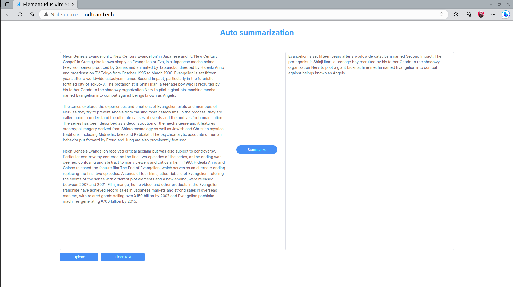

# Transformer Text Summarization
Final project of Statistical Learning Course.

## Status

<p align="center">
  <a href="https://www.codefactor.io/repository/github/dotrann1412/transformer-text-summarization"></a>
</p>

## Students

| ID | Name |
| -------   | ----- |
| 20120057  | Trần Ngọc Đô |
| 20120024  | Huỳnh Minh Tuấn |

## Overview
This project is a small application of auto text summarization using Transformer architecture. The codebase includes 2 parts
- [Backend Server](server/)
- [Frontend Web](web/)

## Techstack
### 1. Backend
**Languages**:
- Python

**Frameworks/Libraries**:
- Django - Build RESTful API
- SpaceOCR - Process OCR
- Pytorch - Build model and inference
- HuggingFace - Using for Transformer architecture

### 2. Frontend
**Languages**:
- Javascript
- Typescript
- CSS and HTML (markup language)

**Frameworks/Libraries**:
- VueJS - Web structure
- ElementPlus - UI supports
- Axios - API communicating
- Vite - Optimization

## Getting started
```sh
# setup backend
$user cd server
$user python manage.py runserver <server_port>
# setup frontend
$user cd web
$user yarn dev --port <web_port>
```

## Or use our demo application!

From Huggingface: [Link](https://ndtran-t5-small-cnn-daily-mails.hf.space/)

## Web capture


## Issues
Feel free to open any issues.
